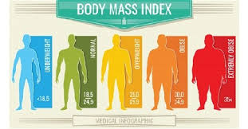

<!DOCTYPE html>
<html>
<head>
    <link rel="stylesheet" href="kode.css">
</head>
<body>
    

        
    

<h1>Welcome</h1>
<nav>
<ul>
    <li><a href="indeks.html">Home</a></li>
    <li><a href="DP.html">Design Process</a></li>
    <li>Produk</li>
</ul>
</nav>
<pre>
    

       Halo teman temann, kalian tau ga sih tentang kalkulator BMI? 
       BMI sendiri adalah indikator pengukuran yang digunakan untuk menentukan 
       kategori berat badan ideal atau tidak.
       Nah kelompok kami membuat aplikasi yang bernama "Kalkulator BMI" , 
       jadi yang belum tau aplikasi BMI Calculator adalah aplikasi untuk 
       mencari solusi dan cepat untuk mengetahui indeks massa tubuh kalian. 
       Dengan aplikasi ini, kalian dapat dengan cepat menghitung BMI kalian 
       berdasarkan berat dan tinggi badan dan dapat memberikan solusi 
       untuk kalian yang kekurangan/kelebihan berat badan.
       Sebelumnya izinkan kelompok kami memperkenalkan diri:
        
        Perkenalan anggota:
        1. Grace Andini (Graphic Designer)
        Graphic Designer adalah profesi di industri kreatif yang bertanggung jawab 
        untuk membuat konten visual sesuai media yang dibutuhkan 
        (digital atau cetak).Konten visual yang dimaksud adalah desain grafis 
        seperti logo, poster, post sosial media, dll.Dalam projek ini saya
        menggambar animasi karakter dan mendekorasi aplikasi yang akan ditampilkan 
        di kalkulator BMI.

        2. Josen Theodore (Content Writing)
        Content writer akan bertanggung jawab terhadap produksi artikel website. 
        Selain itu, content writer juga berhubungan dengan tim kreatif 
        untuk menyesuaikan grafis dengan caption yang harus diunggah 
        di media sosial perusahaan.Dalam projek ini saya bertugas untuk membuat
        caption dari setiap halaman website ini.

        3. Kelvin Stanly (Content Writer)
        Content writer akan bertanggung jawab terhadap produksi artikel website. 
        Selain itu, content writer juga berhubungan dengan tim kreatif 
        untuk menyesuaikan grafis dengan caption yang harus diunggah 
        di media sosial perusahaan.Dalam projek ini saya bertugas untuk membuat
        caption dari setiap halaman website ini.

        4. Priscilla Cecilia (Web Programmer)
        Tanggung Jawab dan Tugas Web Developer adalah merancang tampilan visual 
        dan menu navigasi pada website. Menulis dan meninjau kode untuk situs, 
        biasanya HTML, XML, atau JavaScript. Mengintegrasikan konten multimedia 
        ke situs, termasuk menautkan gambar, video, hingga asset multimedia lainnya. 
        Dalam projek kali ini saya bertugas membuat kerangka html dan css 
        dan membuat kode kalkuator BMI.

        Nah itu saja perkenalan dari kelompok kami,ayo lihat halaman selanjutnya :D
    

</pre>
</body>
</html>
